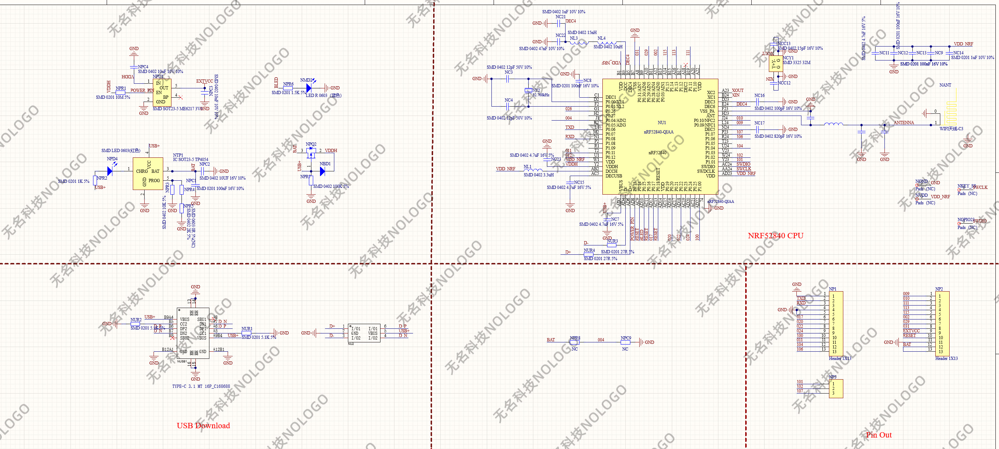

# Zigbee датчик температуры, влажности и давления на ProMicro nRF52840 + BME280

Проект Zigbee-устройства на базе популярной платы **ProMicro nRF52840** и датчика **BME280**.

Устройство предназначено для работы как автономный Zigbee-датчик и передаёт в сеть:

- температуру
- влажность
- давление
- напряжение питания и условный уровень заряда батареи

Проект построен на **nRF Connect SDK**, **Zephyr** и **Zigbee R23**. Это подтверждается текущей реализацией драйверов, Zigbee-структур и приложения. 

---

## Аппаратная платформа

В качестве аппаратной платформы используется **ProMicro nRF52840**.

Особенность этой платы — наличие встроенного **Bootloader**, который позволяет загружать прошивку без подключения отладчика SWD.

### Вход в режим Bootloader

Чтобы перевести плату в режим загрузчика, нужно:

- дважды замкнуть **RST** на **GND** в течение **0.5 секунды**
- после этого подключить плату к компьютеру по USB
- в системе появится накопитель **Nice! Nano**
- на этот накопитель нужно скопировать файл прошивки в формате **`.uf2`**

### Схема платы

---

## Возможности проекта

### Работа с датчиком BME280

В проекте реализовано чтение данных с **BME280** через штатные драйверы **Zephyr**.  
Считываются следующие параметры:

- температура
- влажность
- давление

Датчик инициализируется через Devicetree и используется через стандартную сенсорную подсистему Zephyr. Это видно в драйверной части проекта. :contentReference[oaicite:2]{index=2}

### Измерение напряжения питания

Напряжение питания измеряется через **ADC**.  
На основе измеренного значения рассчитывается условный уровень заряда батареи, который затем публикуется в Zigbee через **Power Configuration cluster**. Это реализовано в коде драйверов и основном приложении. 

### Использование Poll Control cluster

В проект добавлен **Poll Control cluster**.

Он используется для пробуждения устройства кратковременным нажатием кнопки. Такой механизм удобен для параметрирования устройства после установки и включения в Zigbee-сеть. Обработка кнопки и ручной check-in реализованы в основном приложении. :contentReference[oaicite:4]{index=4}

### Энергосбережение

Проект рассчитан на работу от батареи и использует несколько механизмов снижения энергопотребления:

- режим sleepy behavior Zigbee
- перевод BME280 в состояние suspend между измерениями
- отключение неиспользуемых блоков RAM
- редкое пробуждение для передачи данных

Эти механизмы присутствуют в коде проекта и используются при инициализации устройства и работе с датчиком. 

---

## Отладка в процессе разработки

Во время разработки использовалась такая же плата, но с выведенными сигналами:

- SWD
- SCL
- GND
- VDD

Это позволяло выполнять:

- прямую загрузку прошивки
- отладку
- стирание загрузчика при необходимости
- работу с журналом сообщений

---

## Особенности сборки для загрузки через встроенный Bootloader

Поскольку на плате используется встроенный загрузчик, итоговая прошивка должна собираться **не с адреса `0x0000`**, а со смещением, совместимым с Bootloader.

В проекте это решается через **Partition Manager** и статическую карту памяти.

Для такой сборки используется файл:

`/pm_static/pm_static.yml`

Его необходимо скопировать в корень проекта под именем:

`pm_static.yml`

Если этот файл отсутствует, приложение будет собрано с начала флеш-памяти. Такой вариант удобен для загрузки через SWD, но не подходит для записи через встроенный загрузчик платы.

---

## Подготовка сборки для загрузки через Bootloader

Чтобы получить файл прошивки для записи через встроенный загрузчик, необходимо выполнить следующие шаги.

### 1. Отключить журналирование

В файле `prj.conf` отключить или минимизировать вывод логов.

### 2. Подложить статическую разметку памяти

Скопировать файл:

`/pm_static/pm_static.yml`

в корень проекта под именем:

`pm_static.yml`

### 3. Создать отдельную Build Configuration

Использовать следующие параметры:

**Extra CMake arguments:** `-DGEN_UF2=ON`  
**Build mode:** `no sysbuild`

### 4. Собрать проект

После успешной сборки в каталоге

`build/zephyr/`

будет создан файл:

`zephyr.uf2`

---

## Загрузка прошивки в плату

1. Дважды замкнуть **RST** на **GND** в течение **0.5 секунды**
2. Подключить плату к компьютеру по USB
3. Дождаться появления накопителя **Nice! Nano**
4. Скопировать файл `zephyr.uf2` на этот накопитель

После завершения копирования плата перезагрузится и запустит новую прошивку.

---

## Варианты использования при разработке

### Сборка для отладки

Используется при загрузке через SWD и отладке:

- без `pm_static.yml` в корне проекта
- приложение собирается для прямой записи во флеш-память
- удобно для тестирования и отладки

### Сборка для загрузки через встроенный Bootloader

Используется для обычной эксплуатации платы без подключения SWD:

- с `pm_static.yml` в корне проекта
- с генерацией `uf2`
- с загрузкой через встроенный Bootloader

---

## Zigbee-функциональность

Устройство использует Zigbee endpoint со следующими основными кластерами:

- Basic
- Identify
- Power Configuration
- Temperature Measurement
- Relative Humidity Measurement
- Pressure Measurement
- Poll Control

Это соответствует текущему описанию кластеров и атрибутов в проекте. 

---

## Назначение проекта

Проект можно использовать как основу для:

- автономного Zigbee-датчика микроклимата
- устройства на батарейном питании
- домашней автоматизации
- собственных Zigbee-устройств на базе nRF52840 и Zephyr

---

## Примечание

Проект ориентирован на плату **ProMicro nRF52840** со встроенным Bootloader.  
При использовании другой платы, другого загрузчика или другой схемы записи прошивки карта памяти и параметры сборки могут отличаться.