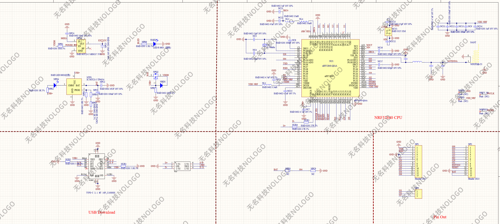

# Zigbee Temperature, Humidity, and Pressure Sensor on ProMicro nRF52840 + BME280

This project is a Zigbee device based on the **ProMicro nRF52840** board and the **BME280** sensor.

The device operates as a standalone Zigbee sensor and reports:

- temperature
- humidity
- pressure
- supply voltage and estimated battery level

The project is built on **nRF Connect SDK**, **Zephyr**, and **Zigbee R23**.

## SDK Version

This repository is currently developed and tested with **nRF Connect SDK v3.4.0**.
Other nRF Connect SDK versions have not been verified.

---

## Hardware Platform

The hardware platform used in this project is the **ProMicro nRF52840** board.

The board has a built-in nRF52 UF2 bootloader, so firmware can be uploaded without an SWD debugger.

### Entering Bootloader Mode

- short **RST** to **GND** twice within **0.5 seconds**
- connect the board to the computer over USB
- a storage device named **Nice! Nano** appears
- copy the generated **`.uf2`** file to this drive

### Board Schematic

<a href="docs/scheme.jpg">
  
</a>

---

## Project Features

### BME280 Sensor Support

The project reads the BME280 through the standard Zephyr sensor subsystem and reports temperature, humidity, and pressure.

### Supply Voltage Measurement

Supply voltage is measured using the ADC. The firmware calculates an estimated battery level and publishes it through the Zigbee **Power Configuration cluster**.

### Poll Control Cluster

The project includes the **Poll Control cluster**. A short button press wakes the device so it can be configured after installation or after joining a Zigbee network.

### Low Power Operation

The project includes:

- Zigbee sleepy behavior
- BME280 suspend mode between measurements
- unused RAM power-down
- infrequent wakeups for data transmission

---

## Zigbee Flash Layout

With Partition Manager disabled, the project uses the current Zigbee add-on Devicetree layout:

`boards/promicro_nrf52840_my_nrf52840.overlay`

includes:

```dts
#include <nrf52840_partitions.dtsi>
```

For nRF52840 this provides the Zigbee storage areas in Devicetree, including:

- `storage_partition`
- `zboss_nvram`
- `zboss_product_config`

The old `pm_static.yml` workflow is no longer used.

---

## Development / SWD Build

For normal development and direct SWD/J-Link flashing:

- make sure there is **no `uf2.conf` in the project root**
- use the normal build configuration
- run a **pristine build** after removing `uf2.conf`

The application is then linked for direct flashing from address `0x0000`.

---

## Built-In Bootloader / UF2 Build

The repository contains:

`uf2/uf2.conf`

To enable the bootloader build, copy it to the project root:

```text
uf2/uf2.conf -> uf2.conf
```

Then run a **pristine build**.

The root `uf2.conf` enables:

```conf
CONFIG_USE_DT_CODE_PARTITION=n
CONFIG_FLASH_LOAD_OFFSET=0x1000
CONFIG_FLASH_LOAD_SIZE=0xF4000
CONFIG_BUILD_OUTPUT_UF2=y
```

This does three things:

1. links the application at `0x1000`, leaving `0x0000..0x0FFF` for the resident bootloader;
2. limits the application region so it does not overlap the Zigbee storage area starting at `0xF5000`;
3. enables Zephyr's built-in UF2 generator.

No extra CMake argument such as `-DGEN_UF2=ON` is required, and no project-local `uf2conv.py` is used.

After a successful build, `zephyr.uf2` is generated by Zephyr next to the other application build outputs.

Before flashing a newly changed memory-layout configuration, verify that `zephyr.hex` starts at address `0x1000`.

---

## Switching Back to SWD Build

Delete the root:

`uf2.conf`

and perform a **pristine build**.

The template remains safely stored as:

`uf2/uf2.conf`

So the same build configuration can be used for both modes; the presence of the root `uf2.conf` is the only switch.

---

## Uploading Firmware to the Board

1. Short **RST** to **GND** twice within **0.5 seconds**
2. Connect the board over USB
3. Wait for the **Nice! Nano** drive
4. Copy `zephyr.uf2` to the drive

The board reboots into the new firmware after the copy completes.

---

## Development and Debugging

During development the same board can be used with:

- SWD
- SCL
- GND
- VDD

This allows direct firmware flashing, debugging, bootloader recovery, and runtime logging.

---

## Zigbee Functionality

The device uses a Zigbee endpoint with these main clusters:

- Basic
- Identify
- Power Configuration
- Temperature Measurement
- Relative Humidity Measurement
- Pressure Measurement
- Poll Control

---

## Intended Use

This project can be used as a base for:

- a standalone Zigbee environmental sensor
- a battery-powered Zigbee device
- home automation projects
- custom Zigbee devices based on nRF52840 and Zephyr

---

## Note

This project is specifically configured for the **ProMicro nRF52840** board with its resident UF2 bootloader.

If another board, bootloader, or memory layout is used, the `0x1000` application offset and flash limits must be reviewed before flashing.
